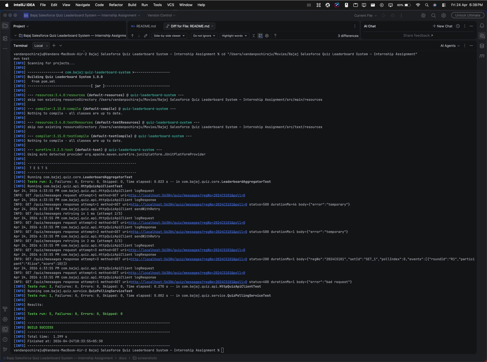
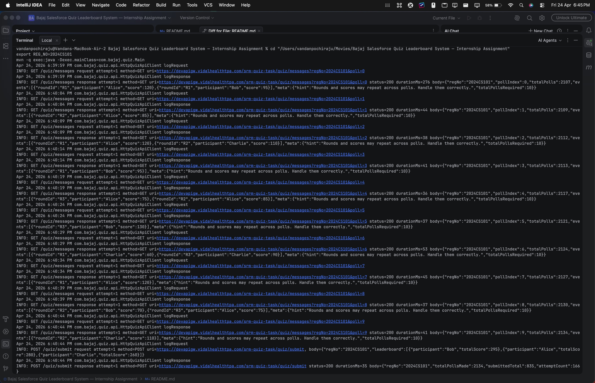
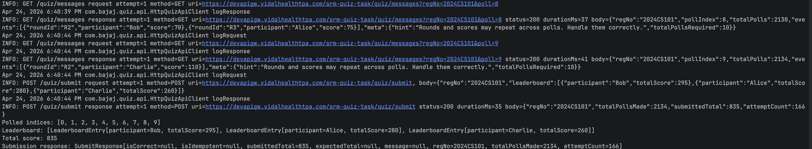

# Quiz Leaderboard System (Java)

This project solves the internship assignment workflow:

1. Poll `GET /quiz/messages` exactly 10 times (`poll=0..9`)
2. Wait 5 seconds between polls
3. Deduplicate events by `(roundId + participant)`
4. Aggregate total score per participant
5. Sort leaderboard by `totalScore` descending (then `participant` ascending for deterministic ties)
6. Compute total score across all users
7. Submit once to `POST /quiz/submit`

## Tech

- Java 17
- Maven
- Jackson (JSON)
- JUnit 5

## Project structure

- `src/main/java/com/bajaj/quiz/Main.java` - CLI entrypoint
- `src/main/java/com/bajaj/quiz/api/HttpQuizApiClient.java` - HTTP integration
- `src/main/java/com/bajaj/quiz/service/QuizPollingService.java` - poll + delay + submit flow
- `src/main/java/com/bajaj/quiz/core/LeaderboardAggregator.java` - dedupe and aggregation logic
- `src/test/java/...` - unit tests

## Source

- Entrypoint: `src/main/java/com/bajaj/quiz/Main.java`
- HTTP client: `src/main/java/com/bajaj/quiz/api/HttpQuizApiClient.java`
- Poll orchestration: `src/main/java/com/bajaj/quiz/service/QuizPollingService.java`
- Aggregation core: `src/main/java/com/bajaj/quiz/core/LeaderboardAggregator.java`
- Models: `src/main/java/com/bajaj/quiz/model/`

## Tests

- `src/test/java/com/bajaj/quiz/core/LeaderboardAggregatorTest.java`
- `src/test/java/com/bajaj/quiz/service/QuizPollingServiceTest.java`
- `src/test/java/com/bajaj/quiz/api/HttpQuizApiClientTest.java`

Run tests:

```bash
mvn test
```

## Run app

Use either environment variable:

```bash
export REG_NO=2024CS101
mvn -q exec:java -Dexec.mainClass=com.bajaj.quiz.Main
```

Or pass as argument:

```bash
mvn -q exec:java -Dexec.mainClass=com.bajaj.quiz.Main -Dexec.args="--regNo=2024CS101"
```

Optional overrides:

- `QUIZ_BASE_URL` (default: `https://devapigw.vidalhealthtpa.com/srm-quiz-task`)
- `QUIZ_API_TIMEOUT_SECONDS` (default: `30`)
- `QUIZ_API_MAX_ATTEMPTS` (default: `3`)
- `QUIZ_API_INITIAL_BACKOFF_MILLIS` (default: `500`)
- `QUIZ_API_MAX_BACKOFF_MILLIS` (default: `4000`)

## Retry/backoff and logging

- Retries are applied only for transient failures: `408`, `429`, and `5xx`, or network `IOException`.
- Backoff is exponential and bounded by `QUIZ_API_MAX_BACKOFF_MILLIS`.
- API request/response logs are emitted via `java.util.logging` and include:
  - endpoint and method
  - attempt number
  - response status and duration
  - truncated request/response body preview

## Notes

- The app enforces one submit per process run.
- If the API returns duplicate messages in later polls, duplicates are ignored by `(roundId, participant)` key.
- Submission response is printed with correctness fields.
- Some validator runs may return acknowledgement-only submit fields (for example `regNo`, `submittedTotal`, `attemptCount`) instead of correctness verdict fields.

## GitHub-ready submission checklist

- [ ] Public repository created with this full project.
- [ ] `README.md` includes setup, run instructions, and assumptions.
- [ ] Test evidence captured (`mvn test` output screenshot).
- [ ] Final app run evidence captured with real `regNo` and submission response.
- [ ] Code pushed with clean commit history and no secrets.

### Suggested screenshot/output format

Store screenshots under `docs/screenshots/` with the following names:

- `docs/screenshots/01-tests-passed.png` - terminal showing `mvn test` success
- `docs/screenshots/02-app-run.png` - terminal showing poll flow and final submit response
- `docs/screenshots/03-validator-correct.png` - response section highlighting `isCorrect`, `submittedTotal`, and `expectedTotal`

### Screenshots

01-tests-passed




02-app-run




03-validator-correct




### Sample output (latest run)

```text
Polled indices: [0, 1, 2, 3, 4, 5, 6, 7, 8, 9]
Leaderboard: [LeaderboardEntry[participant=Bob, totalScore=295], LeaderboardEntry[participant=Alice, totalScore=280], LeaderboardEntry[participant=Charlie, totalScore=260]]
Total score: 835
Submission response: SubmitResponse[isCorrect=null, isIdempotent=null, submittedTotal=835, expectedTotal=null, message=null, regNo=2024CS101, totalPollsMade=1809, attemptCount=147]
```

Include this compact run log snippet in README or PR description:

```text
Polled indices: [0, 1, 2, 3, 4, 5, 6, 7, 8, 9]
Leaderboard: [...]
Total score: <number>
Submission response: SubmitResponse[isCorrect=true, ...]
```
